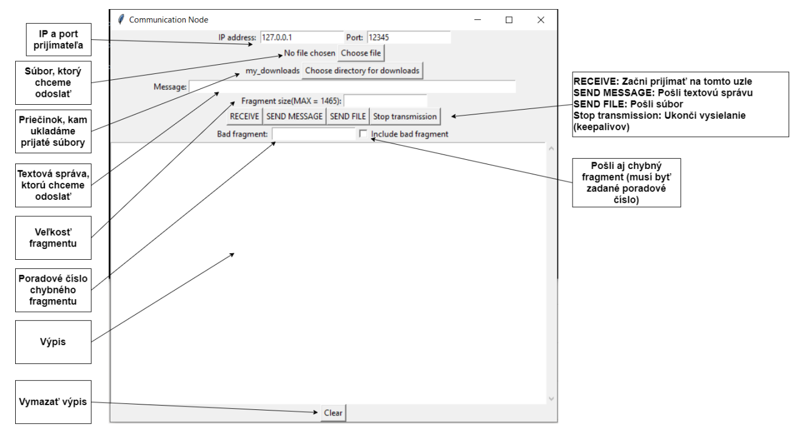

# UDP Communicator
Implementácia vlastného komunikačného protokolu nad UDP s použitím 
**ARQ metódy stop-and-wait**. 

## Používateľská príručka

Program je v jazyku Python 3 a spúšťa sa v konzole cez súbor commnode.py a to štandardným 
spôsobom:
`$ py commnode.py` 

Sockety sú v niektorých prípadoch neblokujúce (timeout = 0): prijímateľ pred začiatkom komunikácie 
alebo obidva počas keepalive fázy. Je to preto aby sme mohli program bez problému ukončiť a znova 
zapnúť bez toho aby sme čakali na ukončenie threadov.

